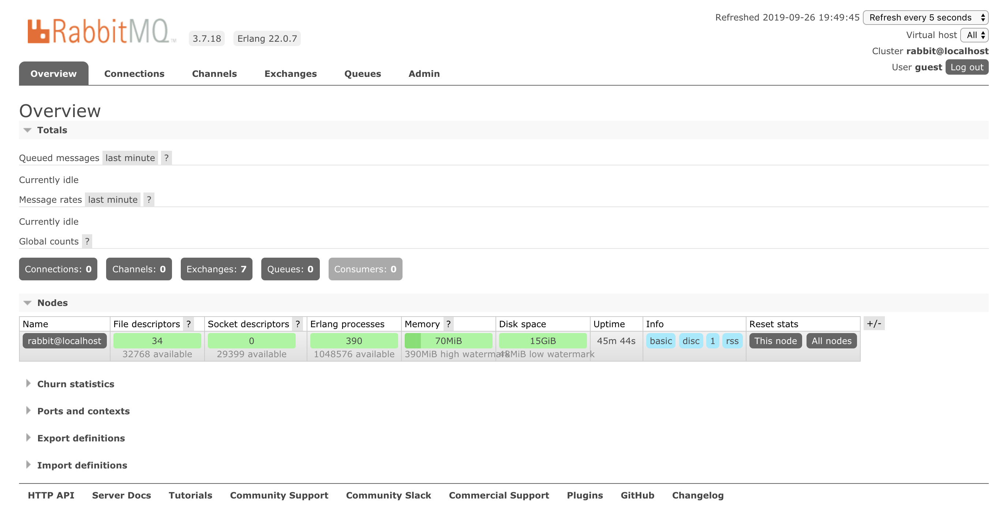

### RabbitMQ

#### RabbitMQ简介

##### 什么MQ

`MQ `(Message Quene);翻译为`消息队列`,通过典型的`生产者`和`消费者`模型,生产者不断向消息队列中生产消息，消费者不断的从队列中获取消息。因为消息的生产和消费都是异步的，而且只关心消息的发送和接收，没有业务逻辑的侵入，轻松的实现系统间解耦。别名为`消息中间件`通过利用高效 可靠的消息传递机制进行平台无关的数据交流，井基于数据通信来进行分布式系统的集成。

> 当今市面上有很多主流的消息中间件，如老牌的`ActiveMQ`、`RabbitMQ`, 炙手可热的`Kafka`,阿里巴巴自主开发`RocketHQ`等.

##### 不同MQ特点

```markdown
# 1.ActiveMQ
		ActiveMQ 是Apache出品，最流行的，能力强劲的开源消息总线。它是一个完全支持JMS规范的的消息中间件。丰富的API,多种集群架构模式让ActiveMQ在业界成为老牌的消息中间件,在中小型企业颇受欢迎!

# 2.Kafka
		Kafka是LinkedIn开源的分布式发布-订阅消息系统，目前归属于Apache顶级项目。Kafka主要特点是基于Pull的模式来处理消息消费，
		追求高吞吐量，一开始的目的就是用于日志收集和传输。0.8版本开始支持复制，不支持事务，对消息的重复、丢失、错误没有严格要求，
		适合产生大量数据的互联网服务的数据收集业务。

# 3.RocketMQ
		RocketMQ是阿里开源的消息中间件，它是纯Java开发，具有高吞吐量、高可用性、适合大规模分布式系统应用的特点。RocketMQ思路起
		源于Kafka，但并不是Kafka的一个Copy，它对消息的可靠传输及事务性做了优化，目前在阿里集团被广泛应用于交易、充值、流计算、消
		息推送、日志流式处理、binglog分发等场景。

# 4.RabbitMQ
		RabbitMQ是使用Erlang语言开发的开源消息队列系统，基于AMQP协议来实现。AMQP的主要特征是面向消息、队列、路由（包括点对点和
		发布/订阅）、可靠性、安全。AMQP协议更多用在企业系统内对数据一致性、稳定性和可靠性要求很高的场景，对性能和吞吐量的要求还在
		其次。
```

> `RabbitMQ`比`Kafka`可靠，`Kafka`更适合`IO高吞吐`的处理，一般应用在大数据日志处理或对实时性（少量延迟），可靠性（少量丢数据）要求稍低的场景使用，比如ELK日志收集。

##### RabbitMQ简介

> 基于`AMQP`协议，erlang语言开发，是部署最广泛的开源消息中间件,是最受欢迎的开源消息中间件之一。


`官网`: https://www.rabbitmq.com/

`官方教程`: https://www.rabbitmq.com/#getstarted

##### AMQP 协议

```markdown
 # AMQP 协议
 		AMQP（advanced message queuing protocol）`在2003年时被提出，最早用于解决金融领不同平台之间的消息传递交互问题。顾名思义，AMQP是一种协议，更准确的说是一种binary wire-level protocol（链接协议）。这是其和JMS的本质差别，AMQP不从API层进行限定，而是直接定义网络交换的数据格式。这使得实现了AMQP的provider天然性就是跨平台的。以下是AMQP协议模型:
```


#### RabbitMQ 的安装

`官网下载地址`: https://www.rabbitmq.com/download.html


##### Linux 安装

`Erlang依赖包`:https://bintray.com/rabbitmq-erlang/rpm/erlang

```markdown
# 1.将rabbitmq安装包上传到linux系统中
	erlang-22.0.7-1.el7.x86_64.rpm
	rabbitmq-server-3.7.18-1.el7.noarch.rpm

# 2.安装Erlang依赖包
	rpm -ivh erlang-22.0.7-1.el7.x86_64.rpm

# 3.安装RabbitMQ安装包(需要联网)
	yum install -y rabbitmq-server-3.7.18-1.el7.noarch.rpm
		注意:默认安装完成后配置文件模板在:/usr/share/doc/rabbitmq-server-3.7.18/rabbitmq.config.example目录中,需要	
				将配置文件复制到/etc/rabbitmq/目录中,并修改名称为rabbitmq.config
# 4.复制配置文件
	cp /usr/share/doc/rabbitmq-server-3.7.18/rabbitmq.config.example /etc/rabbitmq/rabbitmq.config

# 5.查看配置文件位置
	ls /etc/rabbitmq/rabbitmq.config

# 6.修改配置文件(参见下图:)
	vim /etc/rabbitmq/rabbitmq.config 
```


```markdown
# 7.执行如下命令,启动rabbitmq中的插件管理
	rabbitmq-plugins enable rabbitmq_management
	
	出现如下说明:
		Enabling plugins on node rabbit@localhost:
    rabbitmq_management
    The following plugins have been configured:
      rabbitmq_management
      rabbitmq_management_agent
      rabbitmq_web_dispatch
    Applying plugin configuration to rabbit@localhost...
    The following plugins have been enabled:
      rabbitmq_management
      rabbitmq_management_agent
      rabbitmq_web_dispatch

    set 3 plugins.
    Offline change; changes will take effect at broker restart.

# 8.启动RabbitMQ的服务
	systemctl start rabbitmq-server
	systemctl restart rabbitmq-server
	systemctl stop rabbitmq-server
	

# 9.查看服务状态(见下图:)
	systemctl status rabbitmq-server
  ● rabbitmq-server.service - RabbitMQ broker
     Loaded: loaded (/usr/lib/systemd/system/rabbitmq-server.service; disabled; vendor preset: disabled)
     Active: active (running) since 三 2019-09-25 22:26:35 CST; 7s ago
   Main PID: 2904 (beam.smp)
     Status: "Initialized"
     CGroup: /system.slice/rabbitmq-server.service
             ├─2904 /usr/lib64/erlang/erts-10.4.4/bin/beam.smp -W w -A 64 -MBas ageffcbf -MHas ageffcbf -
             MBlmbcs...
             ├─3220 erl_child_setup 32768
             ├─3243 inet_gethost 4
             └─3244 inet_gethost 4
      .........
      
# 10.访问web管理界面
	http://10.15.0.8:15672/
```




```markdown
# 12.登录管理界面
	username:  guest
	password:  guest
```

##### docker 安装

```shell
$ docker pull rabbitmq:3.7.7-management

$ docker run -d --rm --name rabbitmq3.7.7 -p 5672:5672 -p 15672:15672 -v `pwd`/data:/var/lib/rabbitmq --hostname myRabbit -e RABBITMQ_DEFAULT_VHOST=my_vhost  -e RABBITMQ_DEFAULT_USER=admin -e RABBITMQ_DEFAULT_PASS=admin rabbitmq:3.7.7-management

# -e 指定环境变量；（
RABBITMQ_DEFAULT_VHOST：默认虚拟机名；
RABBITMQ_DEFAULT_USER：默认的用户名；
RABBITMQ_DEFAULT_PASS：默认用户名的密码
）

# 浏览器打开web管理端：http://Server-IP:15672
```

#### RabbitMQ支持的消息模型


#### RabbitMQ快速入门

##### 引入依赖

```xml

<dependency>
    <groupId>com.rabbitmq</groupId>
    <artifactId>amqp-client</artifactId>
    <version>5.7.2</version>
</dependency>
```

